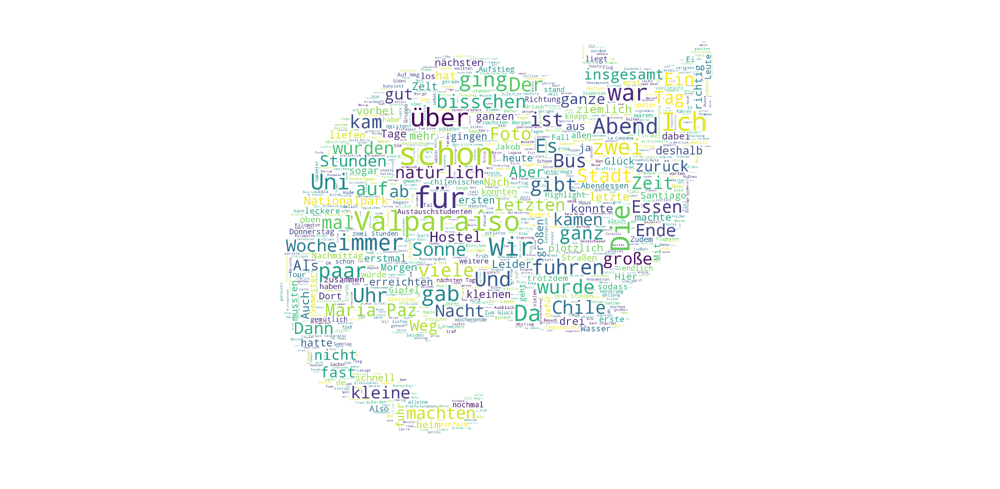

# wordcloud-in-cat-shape

I used a few articles from my travel blog to create a wordcloud with the most used words. 
This wordcloud was shaped in the binary image of our cat (see Mask.png) - which I prepared with paint.

